# 🛡️ NIPS-Plus  
**网络威胁防御 + 资产测绘系统（Golang 开发）**

测试网址：👉 [http://114.115.148.56:8004/](http://114.115.148.56:8004/)

---

## 📖 项目简介
**NIPS-Plus** 是一款使用 **Go (Golang)** 开发的网络威胁防御系统，内置资产测绘功能，专注于网络流量监测、威胁检测与响应、以及资产可视化管理。  

---

## ⚙️ 系统主要功能
- 🕸️ **网络威胁流量可视化（近三天 3D 视图）**  
- 📋 **威胁详细信息浏览与过滤**  
- 🛡️ **攻击 IP 反制与封禁（支持防火墙联动）**  
- ⚖️ **基于规则的威胁检测与浏览（含规则管理）**  
- 🧭 **系统运行状态与引擎性能监控**  
- 🧩 **资产测绘与拓扑可视化**  
- 👥 **用户管理与权限控制**  
- 🔒 **内置防探测机制（支持访问密码配置）**

---

## 🧭 系统界面展示

### 🌐 根目录跳转与防探测功能
| 页面类型 | 示例图 |
|-----------|---------|
| 防探测认证界面 | 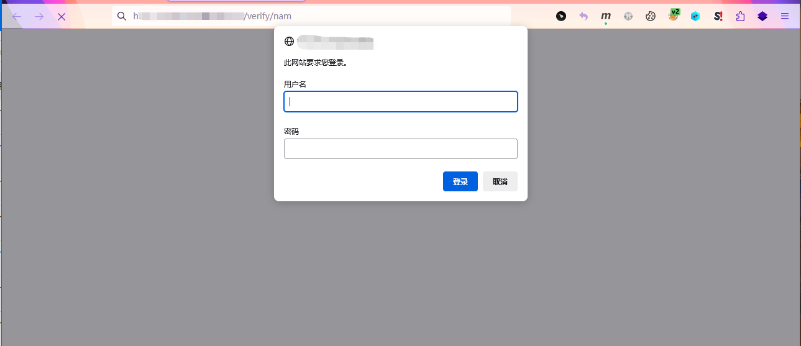 |
| 根目录跳转页 |  |
| 自定义 404 页面 |  |

---

### 📊 网络威胁监控视图
| 模块 | 示例图 |
|------|--------|
| 3D 流量视图 | 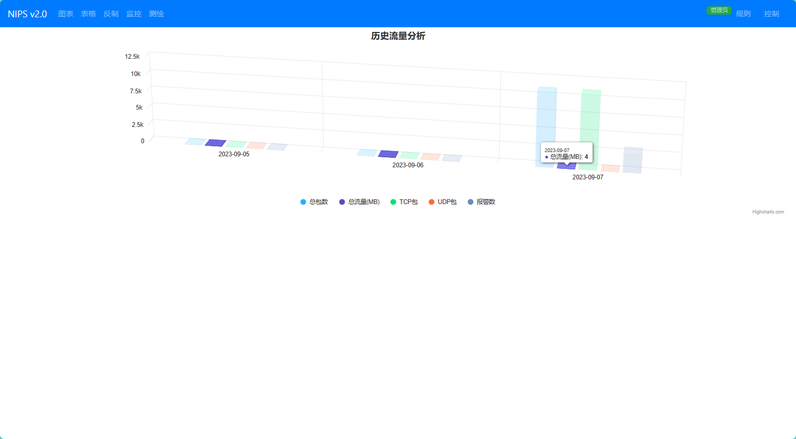 |
| 威胁事件表格 | 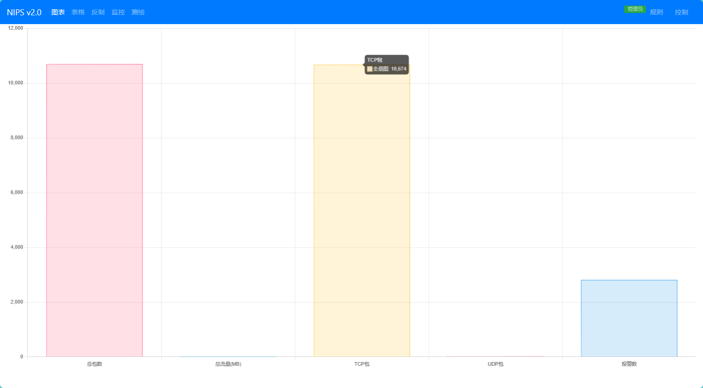 |
| 标签与详情视图 | 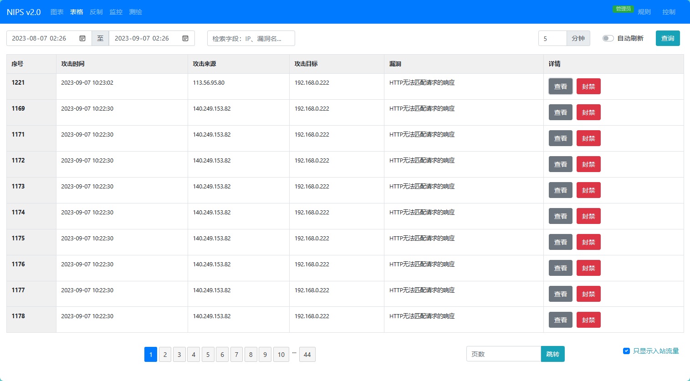 |
| 事件详情列表 | 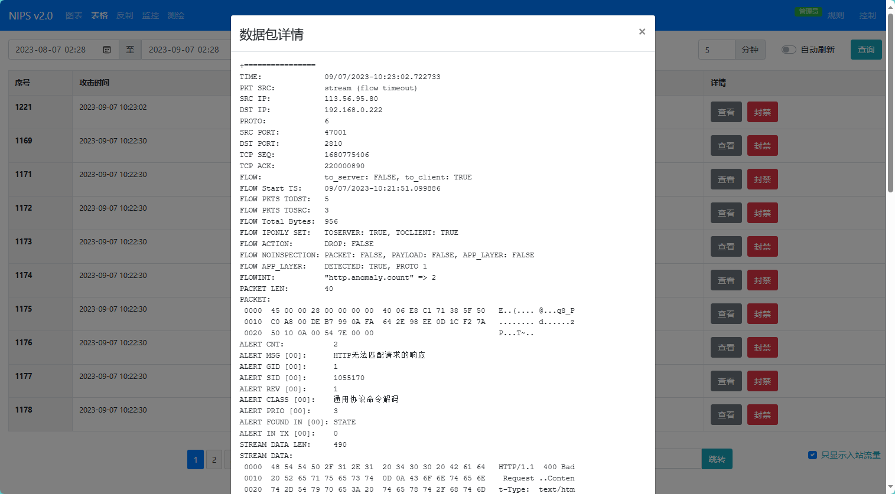 |

---

### ⚔️ 威胁反制与规则引擎
| 功能 | 示例图 |
|------|--------|
| 反制 / 探测攻击 IP | 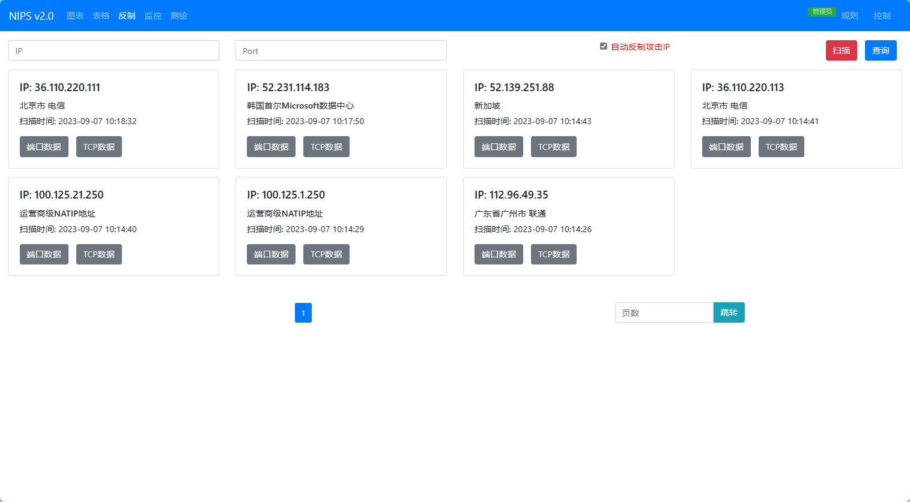 |
| 防火墙联动封禁 | 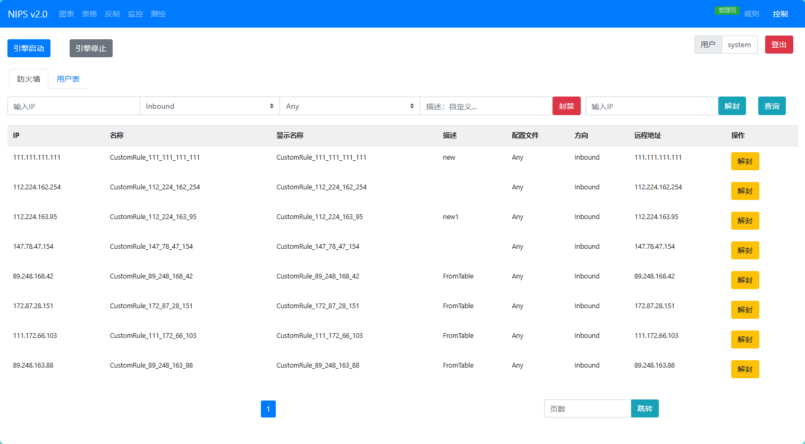 |
| 检测引擎运行状态 | 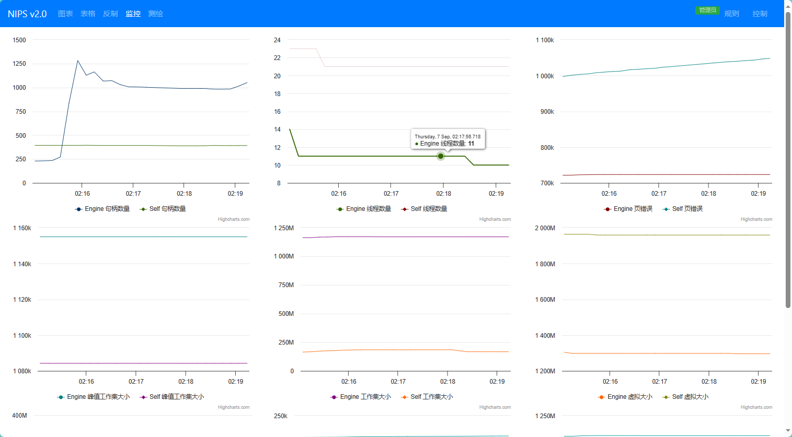 |

---

### 🧩 资产测绘与系统管理
| 功能 | 示例图 |
|------|--------|
| 资产测绘界面 | 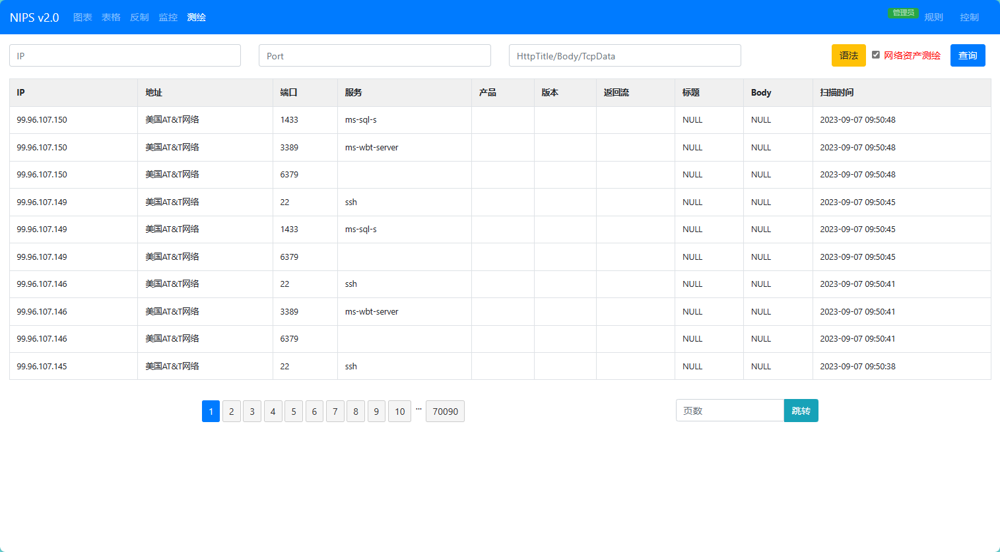 |
| 资产拓扑视图 | 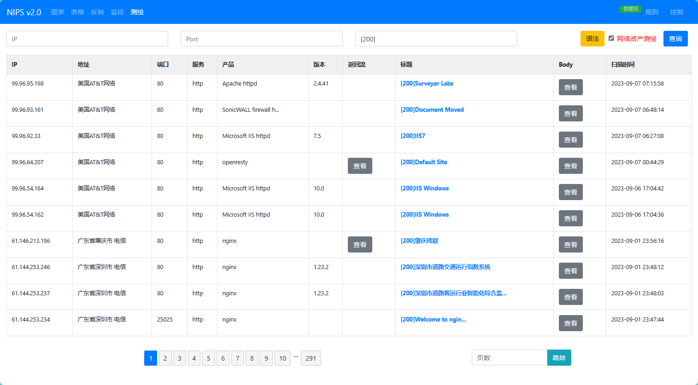 |
| 用户管理 | 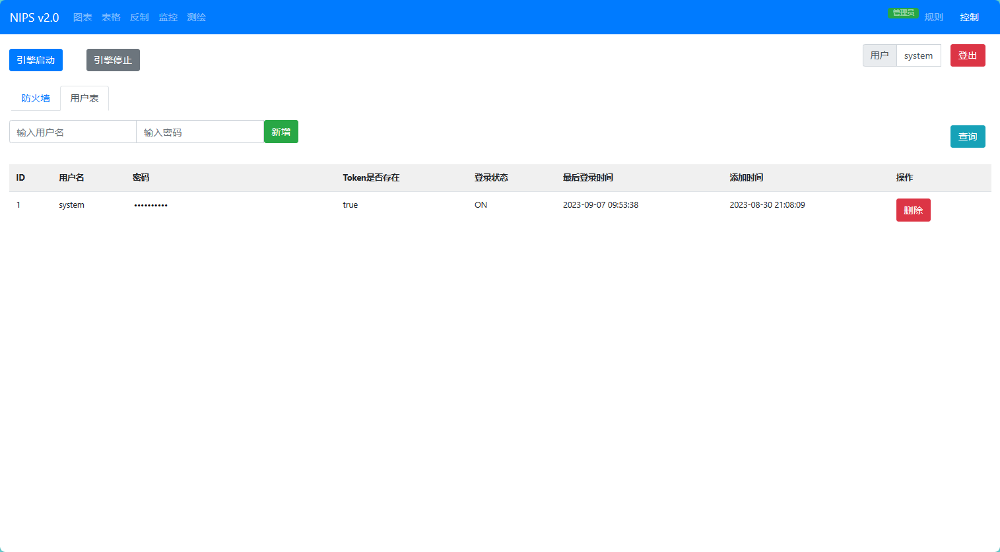 |
| 规则管理 | 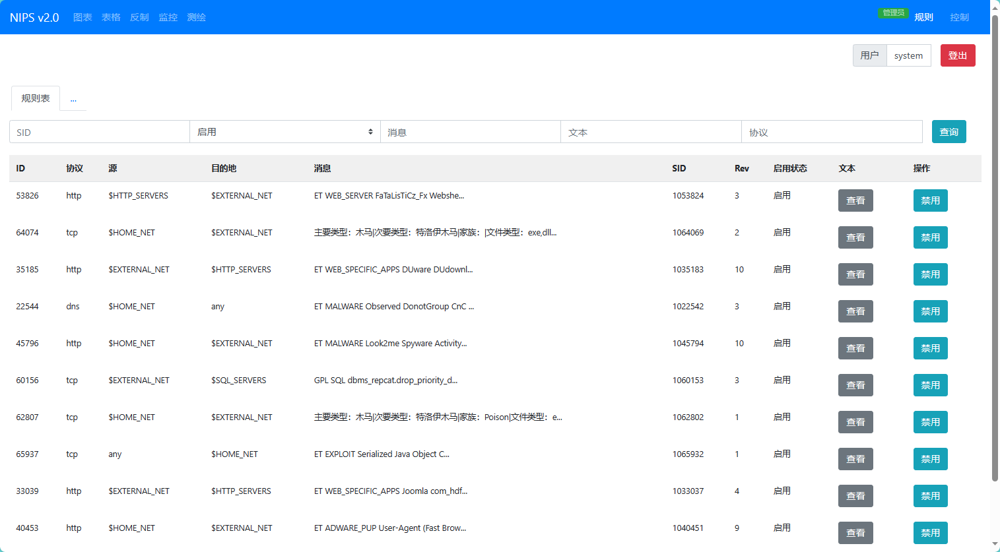 |

---

